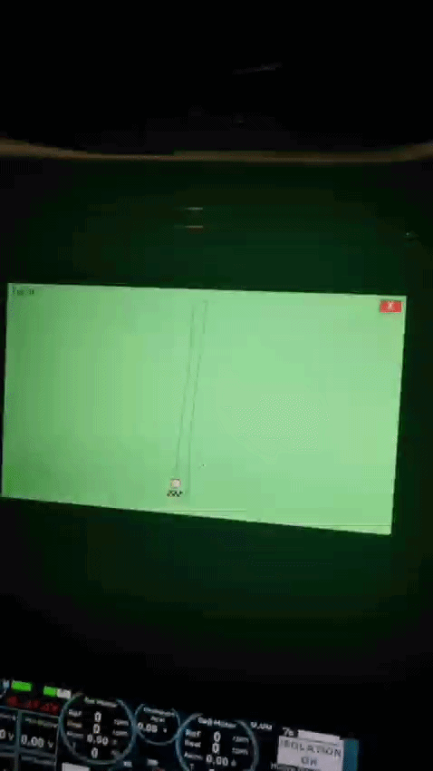

# EV Racing Navigation & Telemetry System

A field-tested, custom-built GPS navigation and lap-timing system designed for competition-level Electric Vehicles. This module successfully powered an EV during the **TEKNOFEST EV Racing Competition**, earning the "Successful" technical certification label.

## 🚀 Key Engineering Features
* **Kalman Filter Integration:** Implements a 4D state (Position & Velocity) Kalman Filter to dramatically reduce raw GPS signal noise and predict accurate vehicle trajectories even during momentary signal loss.
* **Map Matching Algorithm:** Utilizes dynamic projection to snap the filtered GPS coordinates to the nearest valid segment of the pre-defined KML race track, ensuring visual stability on the UI.
* **Haversine Distance Logic:** Calculates precise geographic distances on the Earth's surface for automated finish-line detection and highly accurate lap cooldown timing.
* **NMEA Protocol Parsing:** Directly interfaces with physical GPS hardware via Serial COM ports, processing `$GPRMC` and `$GPGGA` sentences in real-time.
* **Hardware-Agnostic Simulation:** Features a built-in GPS simulator mode with configurable noise levels for rapid software testing without requiring a physical GPS lock.

## 🛠️ Tech Stack
* **Language:** Python 3
* **Signal Processing:** `NumPy`, `FilterPy` (Kalman Filtering)
* **Hardware Interface:** `pyserial`, `pynmea2`
* **UI & Rendering:** `Pygame` (Optimized for 1024x600 embedded touchscreen displays)

## ⚙️ Installation & Usage

1. Clone the repository and navigate to the module: 
   ```bash
   cd navigation_system

2. Install dependencies:

pip install -r requirements.txt

3. Configure the system: 

Open src/main.py.

Set USE_SIMULATOR = False to use physical GPS hardware.

Update the COM_PORT variable to match your GPS module's port (e.g., /dev/ttyUSB0 for Linux/Raspberry Pi, COM3 for Windows).

4. Run the navigation system:

python src/main.py

🗺️ Customizing the Track: 

To use this system for a different race track, simply replace the data/yol.kml file with your own exported 
Google Earth KML route, and update the FINISH_POINT coordinates in src/main.py. 
The rendering engine will automatically calculate the bounding box and scale the map to fit the display aspect ratio.
