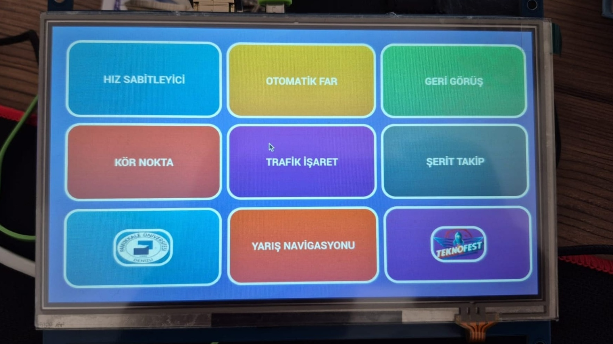

# ADAS Vehicle Dashboard UI

An interactive, touch-enabled central display interface developed for the vehicle cabin. Designed to run on Linux edge environments (such as Ubuntu on Raspberry Pi), this centralized dashboard acts as the brain of the driver's visual feedback system, providing instant access to critical safety warnings and system statuses.

## Features
* **Touch-Optimized Grid Layout:** Large, easily accessible modules specifically designed for in-car touchscreen interactions without distracting the driver.
* **Modular Architecture:** Serves as the central Hub to trigger and monitor separate ADAS sub-systems (Lane Tracking, Blind Spot Monitoring, Traffic Sign Recognition).
* **Low-Latency Rendering:** Built using PyQt5 to ensure smooth performance on edge hardware while allowing seamless integration with AI/Computer Vision Python scripts.
* **Competition Ready:** Custom-tailored telemetry and navigation routing modules integrated for TEKNOFEST EV racing parameters.

## Tech Stack
* **Language:** Python 3
* **UI Framework:** PyQt5 (Python wrapper for the industry-standard C++ Qt framework)
* **Target OS:** Linux (Ubuntu/Raspberry Pi OS)

## Installation & Usage

1. Clone the repository:
   ```bash
   git clone [https://github.com/YOUR_GITHUB_USERNAME/vehicle-dashboard-ui.git](https://github.com/YOUR_GITHUB_USERNAME/vehicle-dashboard-ui.git)
   cd vehicle-dashboard-ui

2. Install the required dependencies: 
pip install -r requirements.txt
## Note: For Linux edge devices, you may also need to install Qt base packages via sudo apt-get install python3-pyqt5 depending on your environment

3. Run the interface:
python main.py
